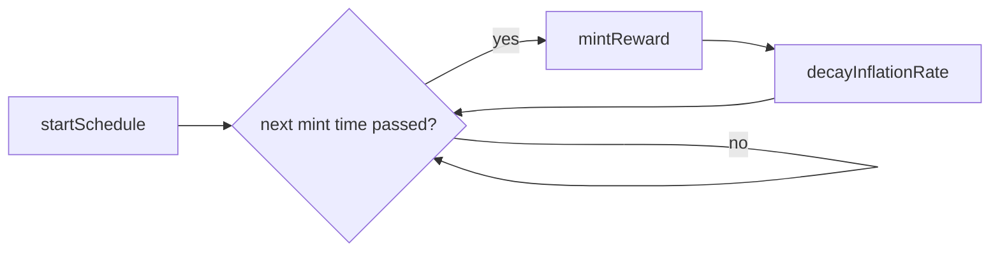
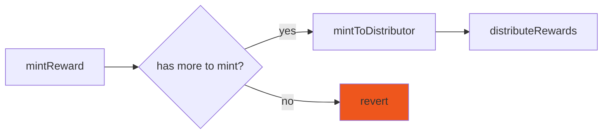
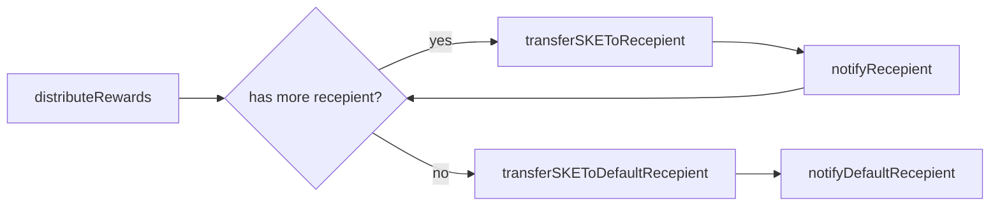

> :warning: These are only for learning purposes. Content may be out of sync with the HEAD. Check the git history to verify

## PerpToken & SupplySchedule & RewardDistribution Lifecycle

## Key Operations

### mintReward()

### distributeRewards()

