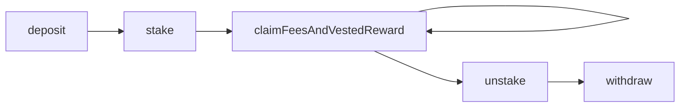
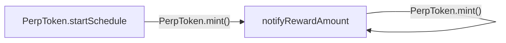
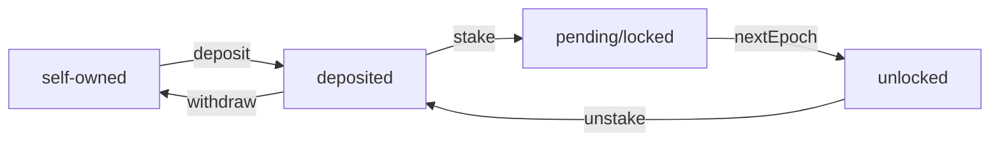
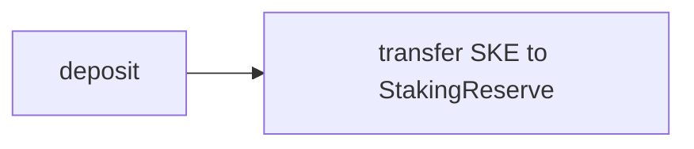
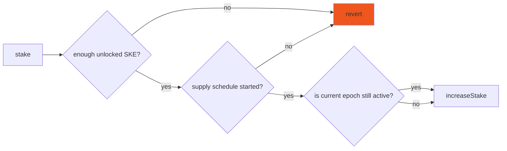
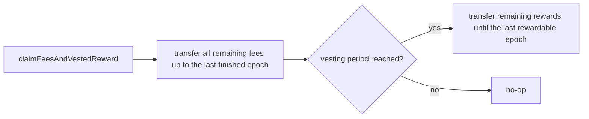
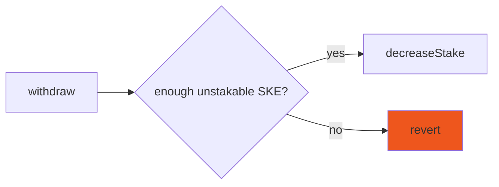
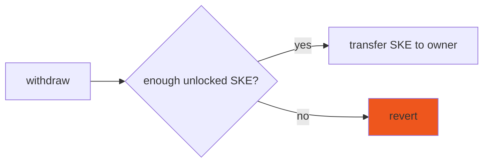
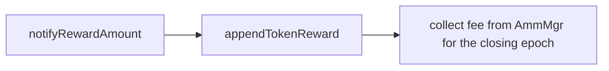

> :warning: These are only for learning purposes. Content may be out of sync with the HEAD. Check the git history to verify

## Staking Lifecycle (staker workflow)

## Staking Lifecycle (reserve workflow)

## Staking Lifecycle (token state-machine)

## Key Operations

### deposit()

### stake()

### claimFeesAndVestedReward()

### unstake()

### withdraw()

### notifyRewardAmount()

